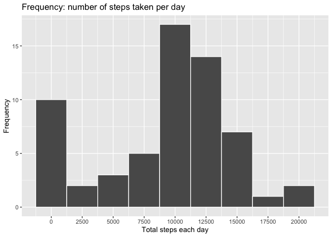
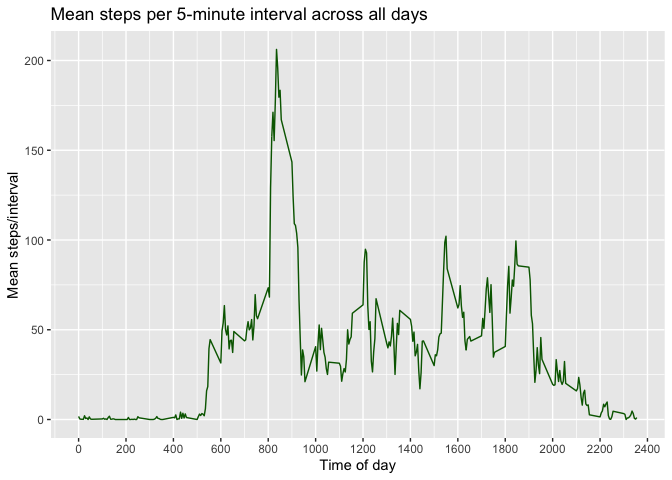
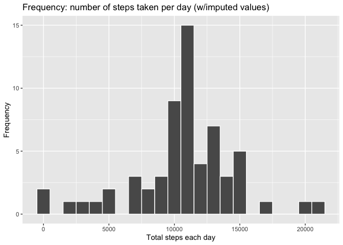
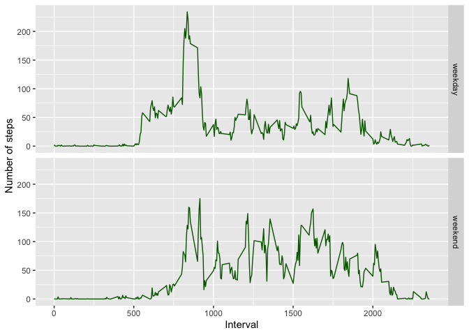

# Course: Reproduceible Research, course assignment 1
## by Josefin L.


```r
if (!file.exists("activity.zip")) {
        download.file("https://github.com/josefinl89/RepData_PeerAssessment1/raw/master/activity.zip", "activity.zip")
        dateDownload <- date()
        print(paste("activity.zip file download date: ", dateDownload))
}
unzip("activity.zip")
data <- read.csv("activity.csv")
```


```r
head(data)
```

```
##   steps       date interval
## 1    NA 2012-10-01        0
## 2    NA 2012-10-01        5
## 3    NA 2012-10-01       10
## 4    NA 2012-10-01       15
## 5    NA 2012-10-01       20
## 6    NA 2012-10-01       25
```

```r
data$date <- as.Date(data$date)
```

## Assingment part: 
## What is mean total number of steps taken per day?

1. Calculate the number of steps taken per day.

```r
library(dplyr)
```

```
## 
## Attaching package: 'dplyr'
```

```
## The following objects are masked from 'package:stats':
## 
##     filter, lag
```

```
## The following objects are masked from 'package:base':
## 
##     intersect, setdiff, setequal, union
```

```r
library(ggplot2)

# Making a data frame that summarise total no. of steps per day
df.dailySteps <- data %>%
        group_by(date) %>%
        summarise(no.daily.steps = sum(steps, na.rm=T))
```

```
## `summarise()` ungrouping output (override with `.groups` argument)
```

```r
df.dailySteps
```

```
## # A tibble: 61 x 2
##    date       no.daily.steps
##    <date>              <int>
##  1 2012-10-01              0
##  2 2012-10-02            126
##  3 2012-10-03          11352
##  4 2012-10-04          12116
##  5 2012-10-05          13294
##  6 2012-10-06          15420
##  7 2012-10-07          11015
##  8 2012-10-08              0
##  9 2012-10-09          12811
## 10 2012-10-10           9900
## # … with 51 more rows
```
\  
\
2. Make a histogram of the total number of steps taken each day.

```r
gg <- ggplot(df.dailySteps, aes(no.daily.steps))
gg + geom_histogram(color="white", binwidth=2500) +
        ggtitle("Frequency: number of steps taken per day") + 
        scale_x_continuous(breaks=seq(0, 25000, 2500)) +
        labs(x="Total steps each day", y="Frequency")
```

<!-- -->

```r
ggsave("plot1_histogr.png")
```

```
## Saving 7 x 5 in image
```
\
\
3. Calculate and report the mean and median of the total number of steps taken per day.

```r
summaryData <- df.dailySteps %>%
        summarise(mean.dailySteps=mean(no.daily.steps, na.rm=T), median.dailySteps=median(no.daily.steps, na.rm=T))
print("Mean and median of total number of steps taken per day:")
```

```
## [1] "Mean and median of total number of steps taken per day:"
```

```r
summaryData
```

```
## # A tibble: 1 x 2
##   mean.dailySteps median.dailySteps
##             <dbl>             <int>
## 1           9354.             10395
```
\

## Assignment part:
## What is the average daily activity pattern?

\
1.Make a time series plot (i.e. type = "l") of the 5-minute interval (x-axis) and the average number of steps taken, averaged across all days (y-axis).

```r
df.interval.mean <- data %>%
        group_by(interval) %>%
        summarise(mean.steps.interval = mean(steps, na.rm=T))
```

```
## `summarise()` ungrouping output (override with `.groups` argument)
```

```r
gg.interval <- ggplot(df.interval.mean, aes(interval, mean.steps.interval))
gg.interval + geom_line(color="darkgreen") +
        labs(title="Mean steps per 5-minute interval across all days", x="Time of day", y="Mean steps/interval") +
        scale_x_continuous(breaks=c(seq(0, 3000, 200)))
```

<!-- -->

```r
ggsave("plot2_timeseries.png")
```

```
## Saving 7 x 5 in image
```
\
\
2. Which 5-minute interval, on average across all the days in the dataset, contains the maximum number of steps?

```r
max.steps.interval <- df.interval.mean$interval[which.max(df.interval.mean$mean.steps.interval)]
print(paste("Interval with maximum number of mean steps across all day: ", max.steps.interval))
```

```
## [1] "Interval with maximum number of mean steps across all day:  835"
```

## Assignment part:
## Imputing missing values
\
1.Calculate and report the total number of missing values in the dataset (i.e. the total number of rows with NA).

```r
print(paste("Number of rows with missing values:",sum(is.na(data))))
```

```
## [1] "Number of rows with missing values: 2304"
```
\
\
2. Devise a strategy for filling in all of the missing values in the dataset. The strategy does not need to be sophisticated. For example, you could use the mean/median for that day, or the mean for that 5-minute interval, etc.
3. Create a new dataset that is equal to the original dataset but with the missing data filled in.

```r
data2 <- data %>% 
        mutate(steps.noNA = if_else(is.na(steps), 
                            round(df.interval.mean$mean.steps.interval[match(data$interval,df.interval.mean$interval)]), round(data$steps)))

sum(is.na(data2$steps.noNA)) # check for NAs
```

```
## [1] 0
```
\
\
4. Make a histogram of the total number of steps taken each day and Calculate and report the mean and median total number of steps taken per day. Do these values differ from the estimates from the first part of the assignment? What is the impact of imputing missing data on the estimates of the total daily number of steps?

```r
sumdata2 <- data2 %>%
        group_by(date) %>% 
        summarise(daily.steps.imputed = sum(steps.noNA))
```

```
## `summarise()` ungrouping output (override with `.groups` argument)
```

```r
ggdata2 <- ggplot(sumdata2, aes(daily.steps.imputed))
ggdata2 + geom_histogram(binwidth=1000,color="white") +
        ggtitle("Frequency: number of steps taken per day (w/imputed values)") + 
        labs(x="Total steps each day", y="Frequency")
```

<!-- -->

```r
ggsave("plot3_histogr.png")
```

```
## Saving 7 x 5 in image
```

```r
comparison <- data.frame(row.id=c("With NA", "No NA"), 
                         mean=c(mean(df.dailySteps$no.daily.steps), mean(sumdata2$daily.steps.imputed)),
                        median=c(median(df.dailySteps$no.daily.steps), median(sumdata2$daily.steps.imputed)))
comparison
```

```
##    row.id     mean median
## 1 With NA  9354.23  10395
## 2   No NA 10765.64  10762
```
Imputing missing data increased the mean and median of daily steps taken.
\
\
## Assignment part:
## Are there differences in activity patterns between weekdays and weekends?
\
1. Create a new factor variable in the dataset with two levels – “weekday” and “weekend” indicating whether a given date is a weekday or weekend day.

```r
data <- data %>% 
        mutate(day = if_else(weekdays(date, T)=="Sat"| weekdays(date,T)=="Sun", "weekend", "weekday"))
data$day <- as.factor(data$day)
str(data) # check factor levels
```

```
## 'data.frame':	17568 obs. of  4 variables:
##  $ steps   : int  NA NA NA NA NA NA NA NA NA NA ...
##  $ date    : Date, format: "2012-10-01" "2012-10-01" ...
##  $ interval: int  0 5 10 15 20 25 30 35 40 45 ...
##  $ day     : Factor w/ 2 levels "weekday","weekend": 1 1 1 1 1 1 1 1 1 1 ...
```
\
\
2.Make a panel plot containing a time series plot (i.e. type = "l") of the 5-minute interval (x-axis) and the average number of steps taken, averaged across all weekday days or weekend days (y-axis). See the README file in the GitHub repository to see an example of what this plot should look like using simulated data.

```r
data.day <- data %>%
        group_by(day, interval) %>%
        summarise(interval.mean = mean(steps, na.rm=T))
```

```
## `summarise()` regrouping output by 'day' (override with `.groups` argument)
```

```r
gg.day <- ggplot(data.day, aes(interval, interval.mean))
gg.day + geom_line(color="darkgreen") +
        facet_grid(day~.) +
        labs(y="Number of steps", x="Interval")
```

<!-- -->

```r
ggsave("plot4_timeseries.png")
```

```
## Saving 7 x 5 in image
```
